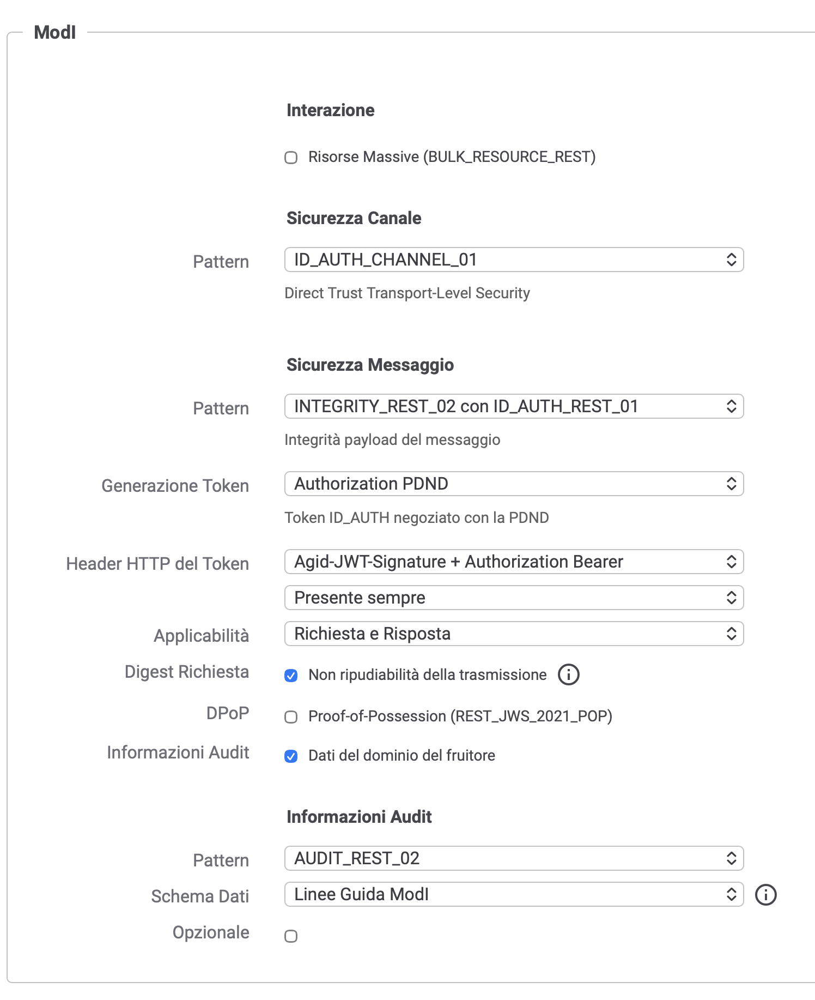
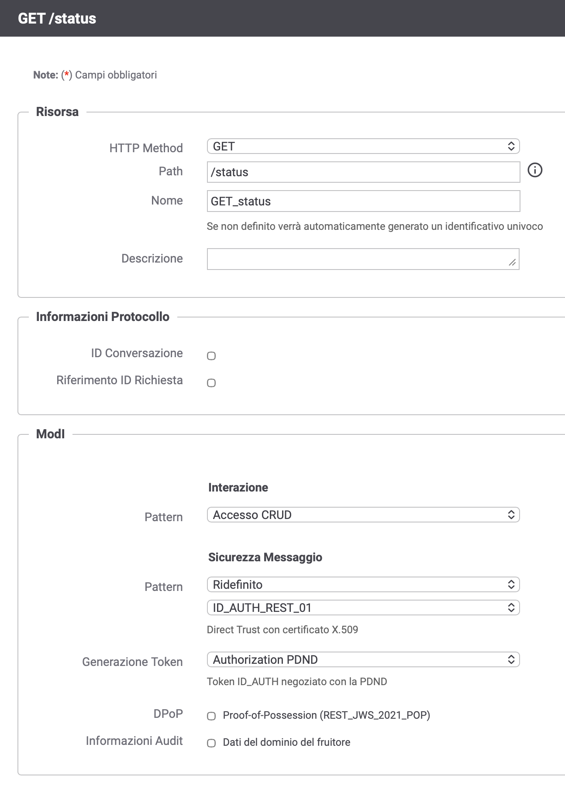

# Implementazione API IT-Wallet: Specifiche Tecniche di Sicurezza

Specifiche obbligatorie per l'implementazione degli endpoint dell'e-service IT-Wallet.

---

## Endpoint `/attribute-claims/{datasetId}`

La chiamata (metodo **POST**) deve implementare i seguenti pattern di sicurezza definiti nell'Allegato 2 del [ModI](https://www.agid.gov.it/sites/default/files/repository_files/linee_guida_interoperabilit_tecnica_pa.pdf):

### 1. INTEGRIT_REST_02 — Integrità del payload (request e response)

- **`Agid-JWT-Signature`**: JWT contenente la firma degli header da proteggere del messaggio
- **`Digest`**: Hash del payload della richiesta

### 2. AUDIT_REST_02 — Tracciatura delle operazioni

- **`Agid-JWT-TrackingEvidence`**: JWT contenente le evidenze di tracciabilità dell'operazione

---

## Endpoint `/status`

L'endpoint (metodo **GET**) è dedicato esclusivamente al controllo della disponibilità del servizio.

**NON DEVE** implementare i pattern di firma o audit:

- ❌ `Agid-JWT-Signature`
- ❌ `Digest`
- ❌ `Agid-JWT-TrackingEvidence`

---

## Configurazione con GovWay

Di seguito si mostra la configurazione per i due endpoint tramite il gateway **GovWay**.

> L'approccio consigliato è definire il profilo di interoperabilità a livello di API e applicare un override sulla sola risorsa `/status`.

### `/attribute-claims/{datasetId}`

1. Dal menu laterale, sezione **Registro**, aprire la pagina **API**.
2. Selezionare l'API da configurare.
3. Cliccare sulla matita per modificare il **Profilo Interoperabilità**.
4. Impostare i parametri come mostrato e salvare.

### `/status`

1. Dalla vista dell'API, cliccare su **Risorse**.
2. Selezionare la risorsa `/status`.
3. Impostare i parametri come mostrato e salvare.

